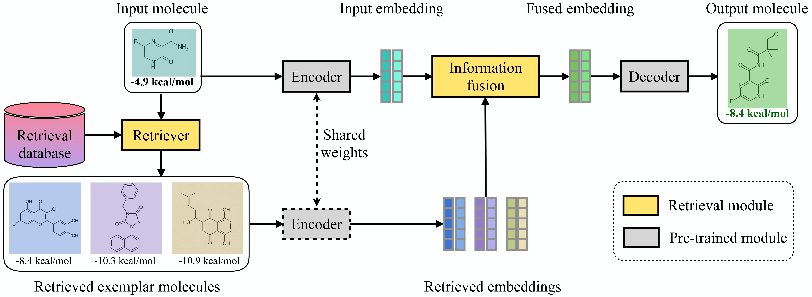
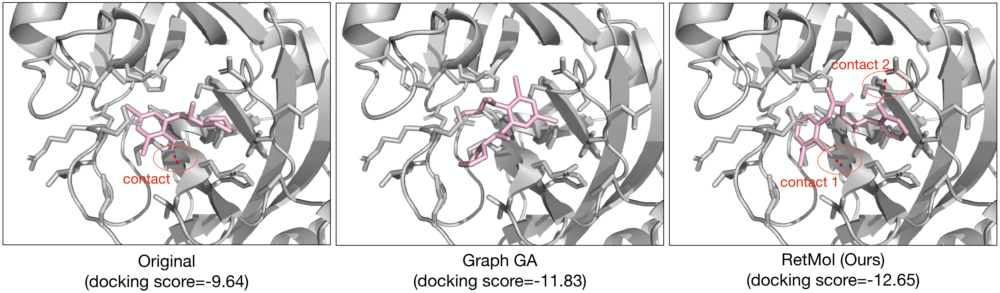

# RetMol: Retrieval-based Controllable Molecule Generation

<p align="center">

</p>
<p align="center">

</p>
<br>

This repo contains codes used in the paper:
<br>
[**Retrieval-based Controllable Molecule Generation**](https://arxiv.org/abs/2208.11126).

_Abstract: Generating new molecules with specified chemical and biological properties via generative models has emerged as a promising direction for drug discovery. 
However, existing methods require extensive training/fine-tuning with a large dataset, often unavailable in real-world generation tasks. 
In this work, we propose a new retrieval-based framework for controllable molecule generation. We use a small set of exemplar molecules,  i.e., those that (partially) satisfy the design criteria, to steer the pre-trained generative model towards synthesizing molecules that satisfy the given design criteria. 
We design a retrieval mechanism that retrieves and fuses the exemplar molecules with the input molecule, which is trained by a new self-supervised objective that predicts the nearest neighbor of the input molecule. We also propose an iterative refinement process to dynamically update the generated molecules and retrieval database for better generalization.
Our approach is agnostic to the choice of generative models and requires no task-specific fine-tuning.
On various 
tasks ranging from simple design criteria to a challenging real-world 
scenario for designing lead compounds that bind to the SARS-CoV-2 main protease,
we demonstrate our approach extrapolates well beyond the retrieval database, and achieves better performance and wider applicability than previous methods._

## Set up
The easiest way to run the code is via the provided docker image. The docker image has several conda environments that enable experimentations without much further configurations.

1. clone this repo. assume its directory path on your machine is `$RetMol_dir`
1. pull the docker image via `docker pull moonlightlane/retmol`
1. start a docker container with the command 
`docker run --gpus all -it --name retmol -p 8888:8888 -v $RetMol_dir:/mnt/retmol --shm-size 8G moonlightlane/retmol:latest /bin/bash` . 
Replace `$RetMol_dir` with this repo's directory path. after this step, you will be inside the docker environment.
1. run `conda activate drug`. Then run `export PROJECT_HOME=/mnt/retmol` , and finally `cd /mnt/retmol` .
1. the container can be exited via `exit` and re-entered via `docker start $ID` then `docker exec -it $ID /bin/bash` , where `$ID` is the identifier number of the docker container. This identifier can be found via `docker container ls -all`

After these steps, you are almost ready to try out a bunch of things (see below). You may need to download certain files; please refer to each section below for the necessary additional steps.


#### Code organization
- `MolBART` contains the training scripts and the model files
- `inference` contains scripts that run various experiments including QED, penalized logP, gsk3+jnk3, and SARS-CoV-2
- `guacamol` contains scripts that run the guacamol experiment
- `eval_notebooks` contains jupyter notebooks to reproduce results in our paper
- `download_scripts` contains scripts to download necessary files for training, inference, and reproducing results

#### Model checkpoints
The model checkpoints can be downloaded via `cd download_scripts` then `sh download_models.sh` . The RetMol checkpoints are now in `/mnt/retmol/models/retmol_*` (assume this step is done inside the docker container)

## Reproduce results in the paper
1. Download the result files. First `cd download_scripts` , then `sh download_results_reproduce.sh` . This will create a directory `results_reproduce` under `$PROJECT_HOME` .
1. Go to the folder `eval_notebooks` . There are three jupyter notebooks that reproduces plots and visualizations that appear in our paper. These can be run by first running this command inside Docker `jupyter notebook --ip 0.0.0.0 --no-browser --allow-root` and then open the link in your browser.  

## Run training  
1. Training leverages the pre-computed molecule similarity data, which can be downloaded by first `cd download_scripts` and then `sh download_data_ret_precompute.sh` . This will create a directory `data/similarity-precompute` under `$PROJECT_HOME` .
1. run `bash train_megatron_retrieval.sh` to train on the ZINC dataset, or `bash train_megatron_retrieval_chembl.sh` to train on the chebl dataset.

Note that this training only involves a very lightweight information fusion module (< %5 of the total number of model parameters; see Section 2.1 and Appendix A for further details). The rest of the model parameters (e.g., encoder, decoder) are not trained and remain frozen.

## Run inference (qed, penalized logp, gsk3-jnk3)
1. Download the necessary pre-computed similarity and embedding files by `cd download_scripts` and then `sh download_data_ret_precompute.sh` . This step can be skipped if it has already been done in the section "run training" above
1. run `export MASTER_PORT=1234`
1. `cd inference`
1. each of the experiments can be run as following:
   - for QED experiment: `python run_qed.py --model_path models/retmol_zinc --similarity_thres 0.6 --chunk 1`
   - For penalized logP experiment: `python run_logp-sa.py --model_path models/retmol_zinc --similarity_thres 0.6 --chunk 1`
   - for gsk3-jnk3 experiment: `python run_gsk3jnk3.py --model_path models/retmol_chembl --test_data_path data/gsk3jnk3/inference_input/inference_inputs.csv --ret_data_path chembl-4attr --ret_mode per-itr-faiss`
Note that for the first two experiments (QED and penalized logP), the commands above runs for one-eighth (100) of all input molecules (800). The last option, `--chunk`, with options ranging from 1 to 8, changes which portions of the input molecules to run. 

## Run inference (guacamol)
1. Download the necessary files by `cd download_scripts` and then `download_data_guacamol.sh`
1. run the experiment by `python run_retrieval_ga.py --benchmark_id 1` . Change the `--benchmark_id` to run different guacamol benchmarks, 

## Run inference (SARS-CoV-2)
1. Get Autodock-GPU:
   1. under `$PROJECT_HOME`, clone the Autodock-GPU repo: `git clone https://github.com/ccsb-scripps/AutoDock-GPU.git`
   1. `cd AutoDock-GPU` 
   1. `export GPU_INCLUDE_PATH=$YOUR_CUDA_PATH/include` ; then `export GPU_LIBRARY_PATH=$YOUR_CUDA_PATH/lib64` . You need to identify `$YOUR_CUDA_PATH` ; for example, `$YOUR_CUDA_PATH=/usr/local/cuda-10.2` . 
   1. `make DEVICE=GPU NUMWI=256` . You can change the last number to some smaller number, i.e., `128` or `64` .
   1. Note: the above steps are necessary because autodock-gpu is built specific to the system's CUDA version; pre-built binary that does not match your system's CUDA version will not work
1. Download the necessary files via `cd download_scripts` and `sh download_data_cov.sh` 
1. Run the experiment via `cd inference` and `python run_cov.py --model_path models/retmol_chembl --sim_thres 0.6`

## Acknowledgements
This repo in part utilizes codes from the following:
- https://catalog.ngc.nvidia.com/orgs/nvidia/teams/clara/models/megamolbart 
- https://github.com/NVIDIA/cheminformatics 
- https://github.com/MolecularAI/MolBART 
- https://github.com/wengong-jin/multiobj-rationale
- https://github.com/wengong-jin/icml18-jtnn
- https://github.com/BenevolentAI/guacamol 

## License

Please check the [LICENSE](LICENSE) file. This work may be used non-commercially, meaning for research or evaluation
purposes only. For business inquiries, please contact
[researchinquiries@nvidia.com](mailto:researchinquiries@nvidia.com).

## Reference
Feel free to cite the following if you find our work useful:
```
@ARTICLE{retmol,
   author = {{Wang}, Zichao and {Nie}, Weili and {Qiao}, Zhuoran and {Xiao}, Chaowei and {Baraniuk}, Richard and {Anandkumar}, Anima},
   title = "{Retrieval-based Controllable Molecule Generation}",
   journal = {arXiv e-prints},
   eprint = {2208.11126},
   year = 2022,
   month = aug,
}
```
